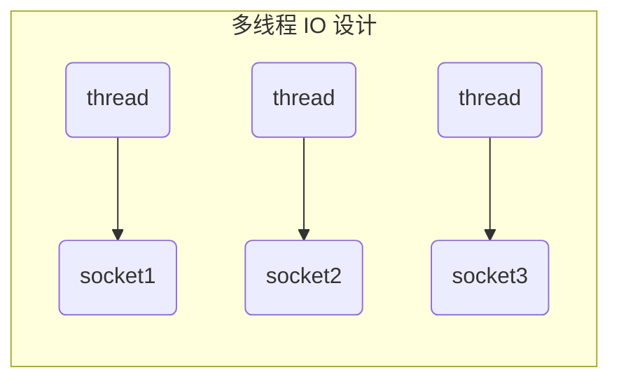
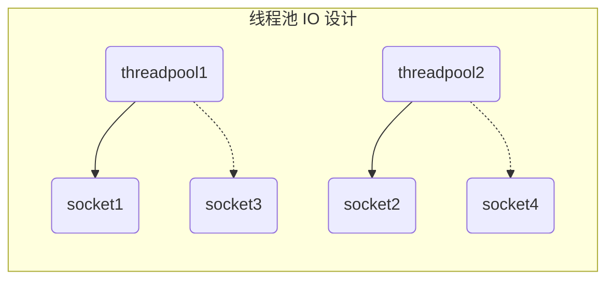
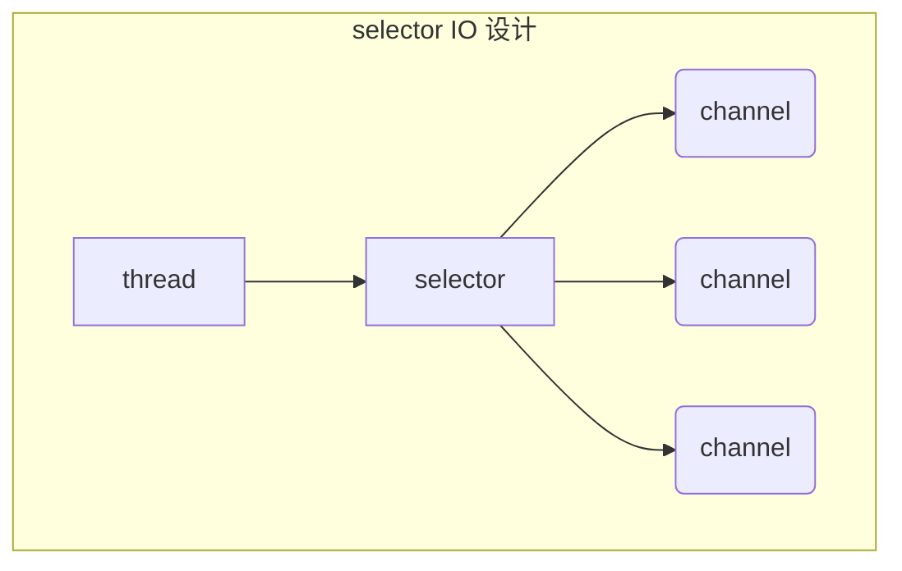

<!-- toc -->


Java 平台提供了一整套 I/O 隐喻，其抽象程度各有不同。然而，离冰冷的现实越远，要想搞清楚来龙去脉就越难。



## 概述

:question:为什么还需要 NIO？


传统的IO的`read`和`write`只能阻塞执行，线程在读写 IO 期间不能干其他事情，比如调用`socket.read()`时，如果服务器一直没有数据传输过来，线程就一直阻塞;通过在 NIO 中配置`socket`为非阻塞模式，NIO将以更加高效的方式进行文件的读写操作，降低 IO 读写耗时



在了解 NIO 细节之前，理解以下概念是非常重要的：「 缓冲区操作 」、「 内核空间与用户空间 」、「 虚拟内存 」、「 分页技术 」、「 面向文件的I/O 」和「 流I/O 」 和 「 多工 I/O（就绪性选择） 」

### 缓冲区操作


缓冲区，以及缓冲区如何工作，是所有 I/O 的基础。



所谓「 输入/输出 」讲的无非就是把数据移进或移出缓冲区。进程执行 I/O 操作，归结起来，也就是向操作系统发出请求，让它要么把缓冲区里的数据排干 (写)，要么用数据把缓冲区填满(读)。进程使用这一机制处理所有数据进出操作。

上图简单描述了数据从外部磁盘向运行中的进程的内存区域移动的过程。进程使用read( )系统调用，要求其缓冲区被填满。内核随即向磁盘控制硬件发出命令，要求其从磁盘读取数据。磁盘控制器把数据直接写入内核内存缓冲区，这一步通过 DMA 完成，无需主 CPU 协助。一旦磁盘控制器把缓冲区装满，内核即把数据从内核空间的临时缓冲区拷贝到进程执行`read( )`调用时指定的缓冲区。



- 用户空间是常规进程所在区域。JVM 就是常规进程，驻守于用户空间。用户空间是非特权区域:比如，在该区域执行的代码就不能直接访问硬件设备。

- 内核空间是操作系统所在区域。内核代码有特别的权力:它能与设备控制器通讯，控制着用户区域 进程的运行状态，等等。



当进程请求 I/O 操作的时候，它执行一个系统调用(有时称为陷阱)将控制权移交给内核。 C/C++程序员所熟知的底层函数 open( )、read( )、write( )和 close( )要做的无非就是建立和执行适当 的系统调用。当内核以这种方式被调用，它随即采取任何必要步骤，找到进程所需数据，并把数据 传送到用户空间内的指定缓冲区。内核试图对数据进行高速缓存或预读取，因此进程所需数据可能 已经在内核空间里了。如果是这样，该数据只需简单地拷贝出来即可。如果数据不在内核空间，则 进程被挂起，内核着手把数据读进内存

:question: 为什么不直接让磁盘控制器把数据送到用户空间的缓冲区？



这样做有几个问题。首先，硬件通常不能直接访问 用户空间。其次，像磁盘这样基于块存储的硬件设备操作的是固定大小的数据块，而用户进程请 求的可能是任意大小的或非对齐的数据块。在数据往来于用户空间与存储设备的过程中，内核负责 数据的分解、再组合工作，因此充当着中间人的角色。



许多操作系统能把组装/分解过程进行得更加高效。根据发散/汇聚的概念，进程只需一个系 统调用，就能把一连串缓冲区地址传递给操作系统。然后，内核就可以顺序填充或排干多个缓冲 区，读的时候就把数据发散到多个用户空间缓冲区，写的时候再从多个缓冲区把数据汇聚起来

这样用户进程就不必多次执行系统调用(那样做可能代价不菲)，内核也可以优化数据的处理 过程，因为它已掌握待传输数据的全部信息。如果系统配有多个 CPU，甚至可以同时填充或排干 多个缓冲区。

### 虚拟内存

所有现代操作系统都使用虚拟内存。虚拟内存意为使用虚假(或虚拟)地址取代物理(硬件
RAM)内存地址。这样做好处颇多，总结起来可分为两大类:



1. 一个以上的虚拟地址可指向同一个物理内存地址
2. 虚拟内存空间可大于实际可用的硬件内存



前一节提到，设备控制器不能通过 DMA 直接存储到用户空间，但通过利用上面提到的第一 项，则可以达到相同效果。把内核空间地址与用户空间的虚拟地址映射到同一个物理地址，这样， DMA 硬件(只能访问物理内存地址)就可以填充对内核与用户空间进程同时可见的缓冲区

通过内存空间多重映射，省去了内核与用户空间的往来拷贝，但前提条件是，内核与用户缓冲区必须使用相同的页对齐，缓冲区的大小还必须是磁盘控制器块大小通常为 512 字节磁盘扇区)的倍 数。操作系统把内存地址空间划分为页，即固定大小的字节组。内存页的大小总是磁盘块大小的倍 数，通常为 2 次幂(这样可简化寻址操作)。典型的内存页为 1,024、2,048 和 4,096 字节。虚拟和 物理内存页的大小总是相同的。

:thinking:NIO主要组件

- NIO 有三大核心部分：**Channel( 通道) ，Buffer( 缓冲区), Selector( 选择器)**

:sparkles:NIO 特性

- NIO与原来的 IO 有同样的作用和目的，但是**使用的方式完全不同**， NIO支持**面向缓冲区的、基于通道的IO操作**

* NIO 的非阻塞模式，使一个线程从某通道发送请求或者读取数据，但是它仅能得到目前可用的数据，如果目前没有数据可用时，就什么都不会获取，而不是保持线程阻塞，所以直至数据变的可以读取之前，该线程可以继续做其他的事情。 
* 非阻塞写与非阻塞读相同，一个线程请求写入一些数据到某通道，但不需要等待它完全写入，这个线程同时可以去做别的事情。
* NIO 是可以做到用一个线程来处理多个操作的。假设有 1000 个请求过来,根据实际情况，可以分配20 或者 80个线程来处理。不像之前的阻塞 IO 那样，非得分配 1000 个
### NIO 与 BIO 的比较

:sparkles:BIO 与 NIO 的比较


- BIO 以流的方式处理数据,而 NIO 以缓冲区的方式处理数据,缓冲区 I/O 的效率比流 I/O 高很多

- BIO 是阻塞的，NIO 是非阻塞的



|            NIO            |         BIO         |
| :-----------------------: | :-----------------: |
|   面向缓冲区（Buffer）    |  面向流（Stream）   |
| 非阻塞（Non Blocking IO） | 阻塞IO(Blocking IO) |

:notes: NIO 是基于缓冲区的操作，数据总是从通道读取到缓冲区，或者从缓冲区写入通道

#### 传统IO方式



#### NIO 方式



## NIO 三大核心原理示意图

NIO 有三大核心部分：**Channel( 通道) ，Buffer( 缓冲区), Selector( 选择器)**



:sparkles:三大组件特点


- 一个线程对应一个Selector ， 一个Selector对应多个 channel(连接)
- Selector 会根据不同的事件，在各个通道上切换
- 程序切换到哪个 channel 是由事件决定的
- 每个 channel 都会对应一个 Buffer
- Buffer 就是一个内存块 ， 底层是字节数组（`byte[]`）
- 数据的读取写入是通过 Buffer完成的 , 但 NIO 的 Buffer 可以读写



:notes: NIO 的核心在于`Channel`和`Buffer`，通道表示打开安到 IO 设备（例如：文件、套接字）的连接。若需要使用 NIO 系统，需要获取用于连接 IO 设别的通道以及用于容纳数据的缓冲区，然后操作缓冲区面对数据进行处理



:older_man: `Channel`负责传输，`Buffer`负责存取数据



## Buffer（缓冲区）

:sparkles: 缓冲区具有如下特点


- 缓冲区本质上是一块可以写入数据以及可以从中读取数据的内存区域
- 这块内存被包装成 NIO Buffer对象，并提供了一组方法，用来方便的访问该块内存
- 相比较直接对数组的操作，Buffer API更加容易操作和管理



## Channel（通道）

:vs: 通道(channel)与流(stream)的对比：


- 既可以从通道中读取数据，又可以写数据到通道（通道是双向的,流是单向的）
- 通道可以非阻塞读取和写入缓冲区
- 通道支持异步地读写缓冲区



## Selector（选择器）

selector 单从字面意思不好理解，需要结合服务器的设计演化来理解它的用途
### 多线程 IO 设计

:warning: 上述的多线程IO设计，会造成系统内存占用过高，线程上下文切换成本高，并且只适合连接数少的场景

### 线程池 IO 设计

:warning: 线程池版本的缺点是在阻塞模式下，线程仅能处理一个 socket 连接，并且这种方式仅适合短连接场景

### selector IO 设计

:sparkles: selector 的作用就是配合一个线程来管理多个 channel，获取这些 channel 上发生的事件，这些 channel 工作在非阻塞模式下，不会让线程吊死在一个 channel 上。适合连接数特别多，但流量低的场景（low traffic）

## 附录

[Java NIO 系列教程](http://ifeve.com/java-nio-all/)
[NIO相关基础篇](https://mp.weixin.qq.com/s?__biz=MzU0MzQ5MDA0Mw==&mid=2247483907&idx=1&sn=3d5e1384a36bd59f5fd14135067af1c2&chksm=fb0be897cc7c61815a6a1c3181f3ba3507b199fd7a8c9025e9d8f67b5e9783bc0f0fe1c73903&scene=21#wechat_redirect)
[Java NIO？看这一篇就够了！](https://blog.csdn.net/forezp/article/details/88414741)
[搞定Java NIO：NIO面试问题梳理](https://blog.csdn.net/shipfei_csdn/article/details/104499525/)

